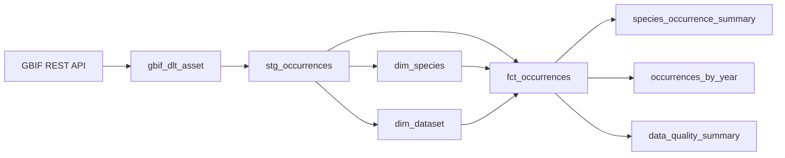

# Dagster Orchestration (`dagster_project`)

## Overview

The `dagster_project` component serves as the central orchestration engine for the Swiss Bird Occurrences data platform. Using [Dagster](https://dagster.io/), it defines software-defined assets (SDAs), establishes end-to-end data lineage across DLT and dbt, runs scheduled pipeline materializations, and provides real-time observability through the Dagster Web UI.

---

## Project Structure

```text
dagster_project/
├── dagster_project/
│   ├── __init__.py
│   ├── assets.py           # DLT asset definition (gbif_dlt_asset)
│   ├── dbt_assets.py       # dbt assets, custom translator, and DbtCliResource
│   └── definitions.py      # Main Dagster definitions (defs, jobs, schedules)
├── dagster_project_tests/  # Project unit tests
├── pyproject.toml          # Python package metadata
└── README.md               # Component documentation
```

---

## Orchestrated Assets & Lineage

Dagster links data ingestion and transformations into a unified Asset Graph:



### 1. `gbif_dlt_asset` (`assets.py`)

- **Type**: Python asset (`@dg.asset`)
- **Execution**: Calls `pipeline.run(gbif_source())` from `dlt_project.pipeline`.
- **Output**: Extracts up to 1,000 Swiss bird occurrence records from the GBIF API and loads them into Snowflake tables `RAW_DATA.OCCURRENCES_RAW` and `RAW_DATA.OCCURRENCES_RAW__ISSUES`.

### 2. `swiss_bird_dbt_assets` (`dbt_assets.py`)

- **Type**: Multi-asset generated dynamically via `@dbt_assets` using `dagster-dbt`.
- **Manifest**: Loads `/dbt-Swiss-Bird-Pipeline/dbt_project/target/manifest.json`.
- **Execution**: Executes `dbt build` streaming logs and asset events.
- **Cross-Tool Lineage (`CustomDagsterDbtTranslator`)**:
  ```python
  class CustomDagsterDbtTranslator(DagsterDbtTranslator):
      def get_asset_key(self, dbt_resource_props):
          resource_type = dbt_resource_props.get("resource_type")
          resource_name = dbt_resource_props.get("name")
          if resource_type == "source" and resource_name == "OCCURRENCES_RAW":
              return dg.AssetKey(["gbif_dlt_asset"])
          return super().get_asset_key(dbt_resource_props)
  ```
  By translating dbt source `OCCURRENCES_RAW` into asset key `gbif_dlt_asset`, Dagster establishes a direct upstream-downstream dependency between the DLT ingestion step and the staging/curated dbt models.

---

## Jobs & Schedules

Defined in `dagster_project/dagster_project/definitions.py`:

### `bird_pipeline_job`

- **Definition**: `dg.define_asset_job(name="bird_pipeline_job", selection=dg.AssetSelection.all())`
- **Behavior**: Materializes all assets in topological order:
  1. Executes `gbif_dlt_asset` (DLT extracts from GBIF $\rightarrow$ loads to Snowflake).
  2. Executes `swiss_bird_dbt_assets` (Runs `dbt build` across Curated staging, dimensions, facts, and Serving summaries).

### `bird_daily_schedule`

- **Definition**: `dg.ScheduleDefinition(job=bird_pipeline_job, cron_schedule="0 2 * * *")`
- **Schedule**: Triggers the entire pipeline automatically once every day at **02:00 UTC**.

---

## Environment Variables & Configuration

Dagster requires credentials to connect to Snowflake for both DLT and dbt:

```env
# Snowflake Connection
SNOWFLAKE_ACCOUNT=<your_account_identifier>
SNOWFLAKE_DATABASE=BIRD_DATA_DB
SNOWFLAKE_USER=<your_username>
SNOWFLAKE_PASSWORD=<your_password>
SNOWFLAKE_WAREHOUSE=COMPUTE_WH
SNOWFLAKE_ROLE=BIRD_DEV_ROLE
SNOWFLAKE_SCHEMA=RAW_DATA

# DLT Credentials
DESTINATION__SNOWFLAKE__CREDENTIALS__HOST=<your_account_identifier>.snowflakecomputing.com
DESTINATION__SNOWFLAKE__CREDENTIALS__DATABASE=BIRD_DATA_DB
DESTINATION__SNOWFLAKE__CREDENTIALS__USERNAME=<your_username>
DESTINATION__SNOWFLAKE__CREDENTIALS__PASSWORD=<your_password>
DESTINATION__SNOWFLAKE__CREDENTIALS__WAREHOUSE=COMPUTE_WH
DESTINATION__SNOWFLAKE__CREDENTIALS__ROLE=BIRD_DEV_ROLE
```

When running in Docker, these variables are passed from `.env` via `env_file: [.env]`.

---

## Running Dagster Locally

### 1. Prerequisites

Ensure dbt has parsed its project and generated `manifest.json`:

```bash
cd dbt-Swiss-Bird-Pipeline/dbt_project
dbt parse
cd ../..
```

### 2. Validate Definitions

Verify that Dagster definitions load properly:

```bash
# In Windows PowerShell from repo root
$env:PYTHONPATH = "."
.\.venv\Scripts\dagster.exe definitions validate -m dagster_project.definitions
```

### 3. Launch Dagster UI Webserver (`dagster dev`)

```bash
# In Windows PowerShell from repo root
$env:PYTHONPATH = "."
$env:DAGSTER_HOME = "$pwd\dagster_project"
$env:DBT_PROFILES_DIR = "$pwd\dbt-Swiss-Bird-Pipeline\dbt_project"

.\.venv\Scripts\dagster.exe dev -m dagster_project.definitions -h 0.0.0.0 -p 3000
```

Open your browser to [http://localhost:3000](http://localhost:3000) to view the Asset Graph and run pipelines.

---

## Triggering Materializations via Dagster UI

1. Navigate to [http://localhost:3000](http://localhost:3000).
2. Go to **Deployment** $\rightarrow$ **Assets** (or the Global Asset Lineage graph).
3. Click **Materialize all** in the top-right corner to trigger `bird_pipeline_job`.
4. Monitor real-time logs and status of each individual model and asset.
5. To activate automated daily runs, navigate to **Automation** $\rightarrow$ **Schedules** and toggle `bird_daily_schedule` on.

---

## Docker Deployment Architecture

In the containerized setup (`docker-compose.yml`), Dagster is split into 3 microservices backed by a dedicated PostgreSQL container:

| Service         | Container Role                                 | Command                                                            | Port                 |
| :-------------- | :--------------------------------------------- | :----------------------------------------------------------------- | :------------------- |
| `postgres`      | Storage for run history, event logs, schedules | Built from `postgres:16` image                                     | `5432` (internal)    |
| `code_location` | gRPC server serving Dagster definitions        | `dagster api grpc -m dagster_project.definitions -p 4000`          | `4000` (internal)    |
| `webserver`     | Dagster web UI                                 | `dagster-webserver -p 3000 -w /app/dagster_project/workspace.yaml` | `3000` (host mapped) |
| `daemon`        | Schedule & sensor daemon                       | `dagster-daemon run -w /app/dagster_project/workspace.yaml`        | N/A                  |
