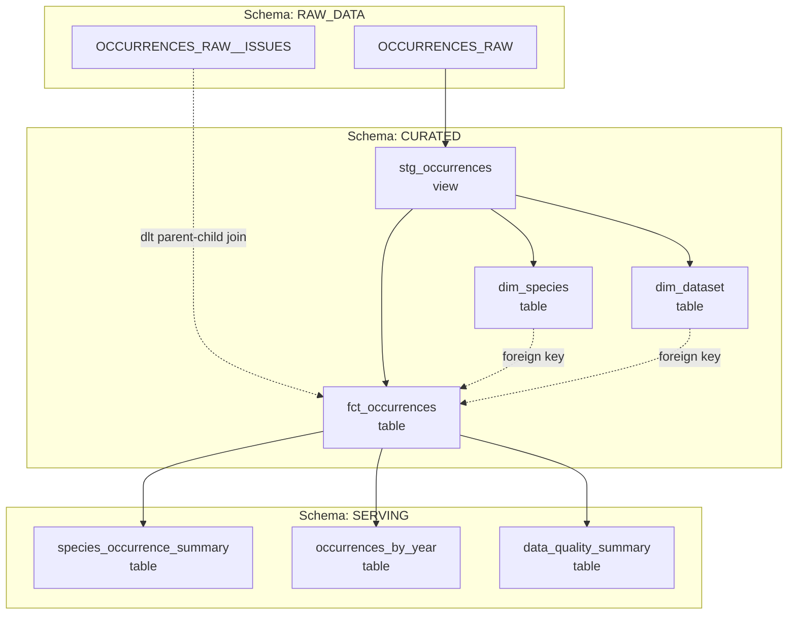

# dbt Analytics Project (`dbt_project`)

## Overview

The `dbt_project` dbt project implements the data transformation, dimensional modeling, data quality testing, and analytical serving layer for the Swiss Bird Occurrences data platform in **Snowflake**.

Data loaded into the raw schema by DLT is transformed through a clean 3-layer architecture:

```text
RAW_DATA (dlt ingestion) ──> CURATED (staging, dimensions, facts) ──> SERVING (marts)
```

---

## Architecture & Data Lineage



---

## Project Structure

```text
dbt-Swiss-Bird-Pipeline/dbt_project/
├── dbt_project.yml              # Project configuration, layer materializations, schemas
├── profiles.yml                 # Snowflake dev profile credentials mapping
├── macros/
│   └── generate_schema_name.sql # Custom schema name generator (preserves clean CURATED / SERVING names)
├── models/
│   ├── curated/
│   │   ├── staging/
│   │   │   ├── sources.yml      # Source definitions for OCCURRENCES_RAW and OCCURRENCES_RAW__ISSUES
│   │   │   └── stg_occurrences.sql
│   │   ├── dimensions/
│   │   │   ├── dim_species.sql
│   │   │   ├── dim_dataset.sql
│   │   │   └── schena.yml       # Tests and docs for dim_species and dim_dataset
│   │   └── facts/
│   │       ├── fct_occurrences.sql
│   │       └── schema.yml       # Tests and relationships for fct_occurrences
│   └── serving/
│       ├── data_quality_summary.sql
│       ├── occurrences_by_year.sql
│       └── species_occurrence_summary.sql
└── README.md                    # Component documentation
```

---

## Data Layers & Models

### 1. Raw Source Layer (`RAW_DATA` Schema)

Defined in `models/curated/staging/sources.yml`:
- `raw_data.OCCURRENCES_RAW`: Primary table loaded by DLT containing the 24 GBIF attributes, plus `media_url` and `_DLT_ID`.
- `raw_data.OCCURRENCES_RAW__ISSUES`: Child table created by DLT containing individual issue flag strings, referenced by `_DLT_PARENT_ID`.

### 2. Curated Layer (`CURATED` Schema)

Configured in `dbt_project.yml` with `+schema: CURATED`:

#### `stg_occurrences`
- **Materialization**: `view`
- **Purpose**: Cleans raw column names to standardized `snake_case`, performs SQL type-casting (e.g. `TO_DATE(EVENT_DATE)`, `TO_VARCHAR(ACCEPTED_SCIENTIFIC_NAME)`), and preserves `_DLT_ID AS dlt_id` for downstream joins.
- **Key Columns**: `occurrence_key`, `dataset_key`, `species_key`, `event_date`, `decimal_latitude`, `decimal_longitude`, `media_url`, `dlt_id`.

#### `dim_species`
- **Materialization**: `table`
- **Purpose**: One row per distinct `species_key`. Deduplicates occurrence records using `ROW_NUMBER() OVER (PARTITION BY species_key ORDER BY CASE WHEN taxonomic_status = 'ACCEPTED' THEN 1 ELSE 2 END, accepted_scientific_name, species_name)` to favor accepted taxonomic designations.
- **Key Columns**: `species_key`, `accepted_scientific_name`, `species_name`, `kingdom`, `taxon_class`, `taxon_order`, `family`, `genus`, `taxon_rank`, `taxonomic_status`.

#### `dim_dataset`
- **Materialization**: `table`
- **Purpose**: One row per distinct `dataset_key`. Computes dataset-level observation summary metrics directly from occurrence records.
- **Key Columns**: `dataset_key`, `record_count`, `first_seen` (`MIN(event_date)`), `last_seen` (`MAX(event_date)`).

#### `fct_occurrences`
- **Materialization**: `table`
- **Purpose**: Central fact table storing observation events. Left-joins `stg_occurrences` with an issue aggregation CTE (`ARRAY_AGG(VALUE) AS issues` from `OCCURRENCES_RAW__ISSUES` on `s.dlt_id = i.dlt_parent_id`), and computes boolean flag `has_media` based on `media_url`.
- **Key Columns**: `occurrence_key`, `species_key`, `dataset_key`, `event_date`, `year`, `month`, `day`, `decimal_latitude`, `decimal_longitude`, `coordinate_uncertainty_m`, `country_code`, `basis_of_record`, `occurrence_status`, `media_url`, `has_media`, `issues`.

---

### 3. Serving Layer (`SERVING` Schema)

Configured in `dbt_project.yml` with `+schema: SERVING` and `+materialized: table`:

#### `species_occurrence_summary`
- **Materialization**: `table`
- **Grain**: One row per `species_key`.
- **Metrics**:
  - `occurrence_count`: Total observations of the species.
  - `first_observed` / `last_observed`: Date range of observations.
  - `dataset_count`: Distinct datasets observing the species.
  - `percentage_observed`: Percentage of records containing valid GPS coordinates (`DECIMAL_LATITUDE IS NOT NULL AND DECIMAL_LONGITUDE IS NOT NULL`).

#### `occurrences_by_year`
- **Materialization**: `table`
- **Grain**: One row per `species_key` $\times$ `year`.
- **Metrics**: `occurrence_count` per species per year, tracking species occurrence trends over time.

#### `data_quality_summary`
- **Materialization**: `table`
- **Grain**: One row per GBIF data quality issue flag.
- **Logic**: Unnests the `issues` array column in `fct_occurrences` using `LATERAL FLATTEN(input => f.issues)` and computes:
  - `record_count`: Distinct occurrence count exhibiting each issue.
  - `pct_of_total`: Percentage of total occurrences impacted by each issue.

---

## Data Quality Tests

The project defines 6 schema tests across `dimensions/schena.yml` and `facts/schema.yml`:

| Model | Column | Test | Purpose |
| :--- | :--- | :--- | :--- |
| `dim_species` | `species_key` | `not_null` | Enforce primary key integrity |
| `dim_species` | `species_key` | `unique` | Enforce unique species dimension records |
| `dim_dataset` | `dataset_key` | `not_null` | Enforce dataset identifier presence |
| `dim_dataset` | `dataset_key` | `unique` | Enforce unique dataset dimension records |
| `fct_occurrences` | `occurrence_key` | `not_null` & `unique` | Enforce fact table grain and uniqueness |
| `fct_occurrences` | `species_key` | `relationships` | Referential integrity to `dim_species.species_key` |
| `fct_occurrences` | `dataset_key` | `relationships` | Referential integrity to `dim_dataset.dataset_key` |

---

## Configuration & Environment Variables

The project connects to Snowflake via `profiles.yml` utilizing environment variables:

```yaml
bird_project_week2:
  outputs:
    dev:
      type: snowflake
      account: "{{ env_var('SNOWFLAKE_ACCOUNT') }}"
      database: "{{ env_var('SNOWFLAKE_DATABASE') }}"
      user: "{{ env_var('SNOWFLAKE_USER') }}"
      password: "{{ env_var('SNOWFLAKE_PASSWORD') }}"
      role: "{{ env_var('SNOWFLAKE_ROLE') }}"
      schema: "{{ env_var('SNOWFLAKE_SCHEMA') }}"
      warehouse: "{{ env_var('SNOWFLAKE_WAREHOUSE') }}"
      threads: 4
  target: dev
```

### Schema Generation Macro (`macros/generate_schema_name.sql`)

By default, dbt appends custom schemas to the default schema name (e.g. `RAW_DATA_CURATED`). The included custom macro:

```sql

    
        {{ target.schema }}
    
        {{ custom_schema_name | trim }}
    

```

Ensures that models configured with `+schema: CURATED` and `+schema: SERVING` land directly in schemas `CURATED` and `SERVING` in Snowflake.

---

## Running dbt Locally

From repository root:

```bash
# Set profiles directory to this project
$env:DBT_PROFILES_DIR = "$pwd\dbt-Swiss-Bird-Pipeline\dbt_project"

# 1. Test Snowflake connection
.\.venv\Scripts\dbt.exe debug --project-dir .\dbt-Swiss-Bird-Pipeline\dbt_project

# 2. Parse the project and generate target/manifest.json (required by Dagster)
.\.venv\Scripts\dbt.exe parse --project-dir .\dbt-Swiss-Bird-Pipeline\dbt_project

# 3. Build all models and execute tests
.\.venv\Scripts\dbt.exe build --project-dir .\dbt-Swiss-Bird-Pipeline\dbt_project

# 4. Run models only
.\.venv\Scripts\dbt.exe run --project-dir .\dbt-Swiss-Bird-Pipeline\dbt_project

# 5. Run tests only
.\.venv\Scripts\dbt.exe test --project-dir .\dbt-Swiss-Bird-Pipeline\dbt_project
```

---

## Integration with Dagster

In `dagster_project/dagster_project/dbt_assets.py`:
- `DbtCliResource` points to `DBT_PROJECT_DIR = PROJECT_ROOT / "dbt-Swiss-Bird-Pipeline" / "dbt_project"`.
- `manifest.json` generated by `dbt parse` is loaded by `@dbt_assets`.
- `CustomDagsterDbtTranslator` translates the dbt source `OCCURRENCES_RAW` into Dagster asset key `gbif_dlt_asset`, connecting DLT directly into the dbt transformation DAG.
